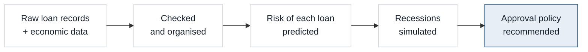
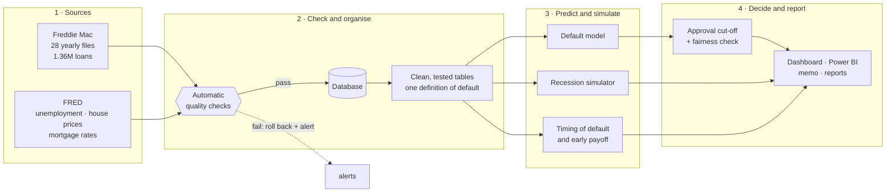

<p align="center">
  
</p>

<p align="center">
  <a href="https://rajivpraveen.github.io/LoanLens/reports/dashboard.html"></a>
  <a href="https://github.com/RajivPraveen/LoanLens/actions/workflows/ci.yml"></a>
  
  <a href="LICENSE"></a>
</p>

<p align="center">
  <a href="#what-is-this">What is this?</a> ·
  <a href="#what-it-found">What it found</a> ·
  <a href="#the-dashboard">The dashboard</a> ·
  <a href="#kpis-on-the-dashboard">KPIs</a> ·
  <a href="#how-it-works">How it works</a> ·
  <a href="#run-it">Run it</a> ·
  <a href="#for-technical-reviewers">Technical details</a>
</p>

## What is this?

**LoanLens predicts which home loans will go bad, estimates how much a recession would cost, and recommends
which new loans a lender should approve.**

When a bank lends someone money for a home, it is making a **30-year bet that the loan will be paid back**. A
lender holds hundreds of thousands of these bets at once, and every month its risk team has to answer four
questions. LoanLens answers them on **real data**: 1.36 million mortgages bought by Freddie Mac between 1999 and
2026, each followed month by month (75 million monthly records) through the 2008 housing crisis, COVID-19 and
the 2022 rate shock.

| # | The question | The short answer |
|:-:|---|---|
| 1 | **How are our loans doing?** | **0.63%** of borrowers are seriously behind (90+ days late) today. At the worst of the 2008 crisis it was **3.5%**. |
| 2 | **Which loans go bad, and why?** | Loans made in **2007 were 4× as likely to default** as loans made in 2003, even though the borrowers had similar credit scores: house prices fell right after they bought. A low credit score is the strongest single warning sign. |
| 3 | **What if a recession hits?** | Across 5,000 simulated economies, the worst 1 in 100 costs **0.64% of the book ($524M of $82B)**. Run through the real 2008-2010 crisis, the model's default forecast landed **within 1%** of what actually happened. |
| 4 | **Which new loans should we approve?** | Almost all of them. Turn away only applicants whose predicted risk of default is **above 4.6%**, about 1 in 180. That avoids 4% of defaults and **adds $2.0M of profit**. Turning away many more would *lose* money, because good borrowers get declined with the bad. |
| + | **Is that policy fair?** | Approval rates stay **within 1%** across regions, states, first-time buyers, single vs. joint borrowers and loan sizes. |



**Why it matters.** Going into 2008, many risk models had only ever seen rising house prices, so they badly
underestimated what a crash would do. LoanLens is built around that lesson: it looks at the economy *after* a
loan is made, it is tested against the 2008 crisis itself, and it says plainly how wrong it could be.

---

## What it found

<details open>
<summary><b>1. Loans made in 2007 lost ten times as much as loans made in 2003, with similar-looking borrowers</b></summary>

<br>

**16.4%** of loans made in 2007 defaulted, and they lost **4.0%** of the amount lent. Loans from 2003 ended at
4.0% and 0.4%. Credit scores were similar (725 vs. 732). The big difference was timing: 2007 loans were made at
the top of the housing market, then house prices fell and unemployment more than doubled. That's why the
recession model uses **house prices and unemployment after the loan was made**, not just the application.

<p align="center"></p>
</details>

<details>
<summary><b>2. COVID looked like 2010 on paper, but it wasn't a credit crisis</b></summary>

<br>

The share of borrowers 90+ days behind jumped to 3.3% in August 2020, as high as the 2010 peak (3.5%). But
leaving out borrowers in COVID forbearance (who were allowed to pause payments), it was only **0.5%**, and
2020-2021 loans have lost almost nothing. So LoanLens doesn't count forbearance as default. Counting it would
teach the model that a spike in unemployment is harmless.
</details>

<details>
<summary><b>3. Credit score matters most, but the number of borrowers is third</b></summary>

<br>

The model ranks **credit score**, **interest rate** and **number of borrowers** as the top warning signs, ahead
of how much was borrowed vs. the home's value and debt-to-income. Loans with a single borrower default at
**1.49×** the rate of loans with two or more, and cash-out refinances at **1.54×**.

<p align="center"></p>
</details>

<details>
<summary><b>4. Recent loans are riskier than the model expects, and the report says so</b></summary>

<br>

The model ranks recent loans well but under-predicts how many default: 0.48% predicted vs. 0.87% actual.
2019 loans ran into COVID, and 2022-2023 loans were made with higher debt-to-income ratios (37-38 vs. 31-35) just
before rates jumped. Re-tuning the model after seeing the test results would be cheating, so the gap is reported
instead, with a recommendation to recalibrate on recent loans before real use.
</details>

<details>
<summary><b>5. A model that has never seen a crisis doesn't know how bad one gets</b></summary>

<br>

Trained on all history, the recession model reproduces 2008-2010 defaults almost exactly (**+1%**). With
2007-2010 hidden from it, it **overshoots by 48%**. A simple long-run average misses by **-69%**. The gap between
the two model versions is a direct measure of how uncertain the worst-case estimates are, and the report shows
it rather than hiding it.

<p align="center"></p>
</details>

<details>
<summary><b>6. Real data is messy, and the automatic checks caught it</b></summary>

<br>

| What the checks found | How it was handled |
|---|---|
| A 1999 loan with a 36-month term broke the 60-480 month rule | The batch was rolled back and an alert raised; the rule was widened to the observed 30-513 month range |
| 39 monthly records with interest rates of 30-50%, about 10× the month before | Tolerated by the check (99.99% threshold), cleared in cleaning, the loan's original rate used instead |
| 2,333 loans (0.17%) in Puerto Rico, Guam and the U.S. Virgin Islands | Kept in the raw data, left out of modelling (no local economic data exists for them) |
| Short sales whose "removed balance" was a few cents | Losses measured against the balance at default instead |
| 756 foreclosure sales that ended in a small gain | Tests allow tiny net-gain dips (up to 0.01%) |
</details>

---

## The dashboard

**[Open the live dashboard](https://rajivpraveen.github.io/LoanLens/reports/dashboard.html)**, no install needed.
Every tab opens with **the question it answers and the short answer**, and every chart has a
"How to read this" line, hover tooltips and a table view.

| Tab | The question it answers |
|---|---|
| Start here | What is this, and what are the four answers? |
| How loans are doing | How many borrowers are behind on payments, today and since 1999? |
| Loans by year made | Which years' loans went bad, and when? (pick any years to compare) |
| Late payments | Are late borrowers catching up or falling further behind? |
| Where the risk is | Which borrowers and which states are expected to lose the most? |
| Recession test | How much could be lost if the economy turns? (filter 5,000 simulated economies) |
| Who to approve | Where should the approval cut-off be? (move the slider and see profit change) |
| Data checks | Can the data be trusted? |

Three things to try:

| Try this | What you'll see |
|---|---|
| **[Move the approval slider](https://rajivpraveen.github.io/LoanLens/reports/dashboard.html#policy)**, and change the margin or loss assumptions | Approval rate, defaults avoided and profit update live, on 500,000 real loans the model never trained on |
| **[Filter the recession scenarios](https://rajivpraveen.github.io/LoanLens/reports/dashboard.html#stress)**, e.g. unemployment +4 points and house prices -20% | How many of the 5,000 simulated economies are that bad, and what the book would lose in them |
| **[Pick years to compare](https://rajivpraveen.github.io/LoanLens/reports/dashboard.html#vintages)**, e.g. 2007 against 2022 | How each year's loans defaulted and lost money as they aged |

<p align="center"></p>

<details>
<summary><b>More of the dashboard</b>: approval simulator, recession test, how loans are doing</summary>

<br>
<p align="center"></p>
<p align="center"></p>
<p align="center"></p>
</details>

The dashboard is a single self-contained file, [`reports/dashboard.html`](reports/dashboard.html), so it also
works offline. It has a dark mode, and most tabs also ship as a **Power BI kit** in [`powerbi/`](powerbi/).

---

## KPIs on the dashboard

These are the measures the dashboard tracks, grouped by tab. Values are for the latest month (March 2026) or
the stated test period. Exact definitions are in [metric definitions](docs/metric_definitions.md).

**How loans are doing**

| KPI | What it tells you | How it's calculated | Value |
|---|---|---|---|
| Money still owed | How much is at risk | Unpaid balance of every loan still being repaid | **$84.5B** |
| Loans being repaid | Size of the book | Loans reporting this month that haven't been paid off or closed | **354,606** |
| Behind on payments (30+ days) | Early warning | Loans at least one payment behind ÷ loans being repaid | **1.82%** |
| Seriously behind (90+ days) | The headline credit KPI | Loans three or more payments behind (or foreclosed) ÷ loans being repaid | **0.63%** (peak 3.5%, Feb 2010) |
| Expected losses, next 12 months | What the book is expected to cost | Σ chance of default × share lost × balance, for every loan | **$43.3M** |
| Average predicted default risk | How risky the book is overall | Balance-weighted 12-month chance of default | **0.52%** |
| Early payoff speed (CPR) | Lost interest income from refinancing | Share of the balance paid off early, annualised | By month |
| Default speed (CDR) | How fast the book is going bad | Share of the balance defaulting, annualised | By month |

**Loans by year made**

| KPI | What it tells you | How it's calculated | Value |
|---|---|---|---|
| Share of loans that defaulted | Which years' loans went bad | Loans from that year that ever defaulted ÷ loans made that year, by months since first payment | 2007: **16.4%** · 2003: **4.0%** |
| Money lost | What those defaults actually cost | Net losses after the home was sold ÷ amount lent that year | 2007: **4.0%** · 2003: **0.4%** |

**Late payments**

| KPI | What it tells you | How it's calculated | Value |
|---|---|---|---|
| Caught up (cure rate) | How often late borrowers recover | Loans 30 days late last month that are on time this month ÷ loans 30 days late | **38%** (last 12 months) |
| Fell further behind (roll rate) | How often trouble gets worse | Loans that moved one step later (e.g. 30 → 60 days) ÷ loans in the earlier state | 30 → 60 days: **17%** (last 12 months) |
| Stuck at 120+ days | How rarely very late loans recover | Loans 120+ days late that are still 120+ days late next month | **86%** (last 12 months) |
| Just missed a payment | The earliest warning of all | On-time borrowers who fell 30 days behind this month ÷ on-time borrowers | By month |

**Where the risk is**

| KPI | What it tells you | How it's calculated | Value |
|---|---|---|---|
| Expected loss by credit score × loan-to-value | Which borrowers are riskiest | 12-month expected loss ÷ balance, for each credit-score and loan-to-value group | **0.16%** riskiest vs. **0.008%** safest |
| Expected loss by state | Where the risk sits geographically | The same rate, by state | Map |
| Behind on payments by credit score | How credit score relates to trouble today | Balance 30+ days late ÷ balance, by credit-score band | By band |

**Recession test**

| KPI | What it tells you | How it's calculated | Value |
|---|---|---|---|
| Loss in an average economy | The expected cost over 3 years | Average loss across 5,000 simulated 36-month economies | **0.17%** ($136M) |
| Loss in a 1-in-100 recession | The bad-case loss capital must cover | 99th-percentile loss across the simulations | **0.64%** ($524M) |
| Average of the worst 1% | How bad the very worst cases are | Average loss of the worst 50 simulations (expected shortfall) | **0.86%** |
| Regulator's severe scenario | A standard test banks are asked to run | Loss if unemployment hits 10% and house prices fall 25% | **1.12%** |
| Backtest error, 2008-2010 | Whether the model can be trusted in a crisis | Predicted ÷ actual defaults for loans held in December 2007, minus 1 | **+1%** |

**Who to approve**

| KPI | What it tells you | How it's calculated | Value |
|---|---|---|---|
| Approval cut-off | Where to draw the line | Predicted default risk above which applicants are declined, chosen to maximise profit on earlier loans | **4.6%** |
| Applications approved | How many applicants still get a loan | Approved ÷ all applicants (tested on 499,777 loans made 2014-2023) | **99.4%** |
| Default rate of approved loans | How much safer the approved book is | Defaults among approved ÷ approved | **0.84%** (vs. 0.87% approving everyone) |
| Defaults avoided | What the policy prevents | Defaults among declined applicants ÷ all defaults | **4.1%** (177 of 4,337) |
| 2-year profit vs. approving everyone | Whether the policy pays off | Margin earned on repaid loans minus losses on defaults, compared with approving everyone | **+$2.0M** (+0.19%) |
| Riskiest 10% capture | How well the model finds bad loans | Share of all defaults that come from the 10% of applicants the model rates riskiest | **39%** |
| Model accuracy (AUC) | Overall ranking quality | Area under the ROC curve on unseen years (0.5 = coin flip, 1 = perfect) | **0.78** |
| Fairness (adverse impact ratio) | Whether any group is approved much less often | Each group's approval rate ÷ the most-approved group's; lowest shown (the "four-fifths rule" flags below 0.80) | **0.992** |

**Data checks**

| KPI | What it tells you | How it's calculated | Value |
|---|---|---|---|
| Automatic checks passed | Whether the data can be trusted | Checks passed ÷ checks run, on every batch before loading | **99.95%** of 1,870 (100% on the data that was loaded) |
| Files loaded / stopped | Whether bad deliveries are caught | Files loaded successfully vs. rejected by the checks | **28** loaded, **1** stopped |

---

## How it works



1. **Load and check.** Each file is checked automatically before it is stored. A bad or re-delivered file can
   never half-load or create duplicates.
2. **Organise.** Clean, tested tables give one agreed definition of "default" that every model and chart uses.
3. **Predict.** A model estimates each loan's chance of default within 2 years, and survival models estimate
   *when* loans default or get paid off early. Models are always tested on years they never saw.
4. **Simulate recessions.** 5,000 possible economies are generated, and the book is run through each one. The
   simulator is checked against what really happened in 2008-2010.
5. **Decide.** The approval cut-off that maximises profit is chosen, checked for fairness, and written up as a
   [one-page memo](reports/lending_memo.md).

It runs automatically on a monthly schedule (Dagster), and is also a `loanlens` command-line tool.

---

## Run it

**1. Set up** (Python 3.11 via [uv](https://docs.astral.sh/uv/)). This creates `.venv` and installs everything:

```bash
make setup
```

**2. Get the data.** Freddie Mac requires a free account, and its terms don't allow sharing the files. At
[freddiemac.com](https://www.freddiemac.com/research/datasets/sf-loanlevel-dataset), under **Standard Dataset
Download by Year**, download the *sample* file for each year (`sample_1999.zip` … `sample_2026.zip`, about
1.1 GB in total) and put them, still zipped, in `data/raw/freddie/`.

**3. Run everything** (about 20 minutes the first time, 6 minutes after that):

```bash
make all
```

Then open `reports/dashboard.html` in a browser.

<details>
<summary><b>Other ways to run it</b></summary>

<br>

| | |
|---|---|
| Step by step | `loanlens fetch-fred \| ingest \| transform \| train \| survival \| stress \| decide \| fairness \| report` |
| Health check | `loanlens status` (load history and data-quality pass rates) |
| Orchestrated | `make dagster`, then open http://localhost:3000 and materialize all assets |
| Docker | `docker compose run --rm pipeline` |
| PostgreSQL serving layer | `docker compose up -d postgres && make publish` |
| Full dataset (~50M loans) | Ingest on Spark/Databricks with [`spark/freddie_ingest_spark.py`](spark/freddie_ingest_spark.py) |
| Tests | `make test`: unit tests, quality gates, idempotency, and an end-to-end run on a small synthetic dataset (CI can't ship the licensed files; synthetic data is never used for results) |

Operations, failure handling and the real-data quirks are in the [runbook](docs/runbook.md).
</details>

---

## For technical reviewers

<details>
<summary><b>Results in detail</b></summary>

<br>

| Area | Result (Freddie Mac Sample, performance through March 2026) |
|---|---|
| Data engineering | 1,362,500 loans and 74,937,616 monthly records ingested incrementally; the quality gates **stopped one real batch** (a 36-month loan term in 1999) before it could load; 78 of 79 dbt tests pass, with 1 deliberate warning for outlier loss severities |
| Default model (tested on 2014-2023 vintages) | **XGBoost AUC 0.783** (95% CI 0.777-0.790) vs **logistic regression 0.737** (+0.046); top decile captures 39.4% of defaults (lift 3.9×) |
| Survival | Cox concordance 0.828 for default; a time-varying Cox model shows how unemployment, negative equity and the refinance incentive move default and prepayment risk month by month |
| Stress test (performing book as of 2026-03: 343,920 loans, $82.3B) | Expected loss **0.17%**, 99th percentile **0.64%**, expected shortfall **0.86%**; CCAR-style severely adverse scenario (unemployment 10%, house prices -25%) **1.12%** |
| Backtest (December 2007 book through the real 2008-2010 economy) | Production model: defaults **+1%**, losses -7% vs actual. With the crisis removed from fitting: **+48%**. Naive through-the-cycle benchmark: **-69%** |
| Approval policy | Decline PD > 4.60%: approves 99.4%, avoids 4.1% of defaults, **+0.19% profit ($2.0M)** on later vintages; larger gains if margins are thinner (+4.5% at a 0.25% margin) |
| Fair lending | Minimum adverse impact ratio **0.992** (four-fifths rule: 0.80). One flag: the PD under-states Florida's risk relative to other states |

Every number above is regenerated by `loanlens report` in [reports/results_summary.md](reports/results_summary.md).
</details>

<details>
<summary><b>Reports</b></summary>

<br>

| Report | What it covers |
|---|---|
| [Lending memo](reports/lending_memo.md) | One page for the credit committee: the recommended cutoff, its profit and trade-offs, risks |
| [Default model](reports/model_report.md) | Out-of-time design, metrics, calibration, stability by vintage, SHAP drivers |
| [Survival analysis](reports/survival_report.md) | Kaplan-Meier, cumulative incidence by era, Cox and time-varying Cox |
| [Stress test](reports/stress_test_report.md) | Loss distribution, named scenarios, loss drivers, 2008-2010 backtest |
| [Fairness review](reports/fairness_review.md) | Approval rates, adverse impact ratios, calibration and AUC by group |
</details>

<details>
<summary><b>Data engineering</b>: incremental loads, quality gates, star schema, orchestration</summary>

<br>

- **Incremental and idempotent.** Each source file is fingerprinted (SHA-256); unchanged files are skipped, and
  a changed file replaces its period inside one transaction (delete + insert), so reruns never duplicate rows.
  The dbt staging and fact tables are incremental on the same key.
- **Quality gates.** Great Expectations suites check keys, uniqueness, value ranges (credit score 300-850,
  rates, LTV, DTI), code sets, date formats and loan-to-performance referential integrity on every chunk. Any
  failure rolls back the period, writes an alert (log, JSON, optional Slack/Teams webhook) and stops the run.
- **Star schema (dbt).** `dim_loan`, the incremental `fct_loan_monthly` (loan × month, 75M rows), `dim_macro`
  (state × month), `dim_date`, `dim_geography`, and marts for delinquency, CPR/CDR, vintage curves, roll-rate
  matrices, risk segments, losses and data quality. 79 generic and singular tests, e.g. roll rates sum to one,
  no activity after termination, the portfolio mart reconciles to the fact table.
- **Scale.** DuckDB runs with a bounded memory limit and spills to disk, so a 16 GB laptop handles 75M
  loan-months. A PySpark job does the same ingestion with Delta partition overwrites for the full dataset.
- **Orchestration.** Dagster assets for every step and every dbt model and test, a schedule, a new-file sensor,
  retries and a run-failure alert. CI (GitHub Actions) runs lint, dbt parse, the tests and a Dagster load check.

Design notes: [docs/architecture.md](docs/architecture.md) · schema: [docs/data_dictionary.md](docs/data_dictionary.md)
</details>

<details>
<summary><b>Credit-risk models</b>: PD, survival, explainability</summary>

<br>

- **Target:** a credit event within 24 months of the first payment (90+ days delinquent outside COVID
  forbearance, REO, or a loss-generating termination).
- **Out-of-time splits:** train on 1999-2011 vintages (648k loans), recalibrate on 2012-2013 (100k), test on
  2014-2023 (500k). Random splits would leak the economy between train and test.
- **Models:** logistic regression baseline vs XGBoost with monotone constraints on credit score, LTV, CLTV and
  DTI; logistic recalibration; bootstrap confidence intervals for AUC. State identity is deliberately excluded
  (fair-lending proxy risk).
- **Explainability:** SHAP global importance and per-loan top-3 risk drivers (the basis for adverse-action
  reason codes).
- **Survival:** Kaplan-Meier by credit band, Aalen-Johansen cumulative incidence for competing risks,
  cause-specific Cox with proportional-hazards tests, and a time-varying Cox model with quarterly macro covariates.
</details>

<details>
<summary><b>Stress testing</b>: hazard models, scenarios, backtest</summary>

<br>

- **Hazard models:** discrete-time logistic models for monthly default and prepayment, fitted on 4.9M
  loan-months with mark-to-market LTV, state unemployment and its 12-month change, the refinance incentive and
  loan attributes. COVID forbearance months are excluded from fitting.
- **LGD:** loss given default by LTV band and mortgage insurance, priced at the expected liquidation date
  (18 months after default) because crisis losses came from prices that kept falling after default.
- **Scenarios:** 5,000 simulated 36-month economies (expansion dynamics estimated since 1990, a recession regime
  at 14% a year, state betas) plus Baseline, Adverse, Severely adverse and a 2008-2010 replay.
- **Projection:** competing-risk run-off of a 10,000-loan sample of the performing book, scaled to the book.
- **Backtest:** the December 2007 book projected through the realised 2008-2010 economy, in-sample,
  out-of-sample and against a naive benchmark.
</details>

<details>
<summary><b>Decision and fairness</b>: profit-based cutoff, fair-lending review</summary>

<br>

- **Profit per loan:** balance × net margin (0.50% a year) × 2 years × (1 - PD) - PD × LGD × balance. The cutoff
  that maximises profit is chosen on the calibration vintages and evaluated on the test vintages with their
  *actual* outcomes, so the reported uplift is out-of-sample.
- **Sensitivity:** thinner margins or 1.5× severity move the cutoff down and raise the uplift, up to +18%.
- **Fair lending:** adverse impact ratio (four-fifths rule), calibration relative to the overall level, and AUC
  by census region, largest states, first-time buyers, number of borrowers and loan size, under the recommended
  cutoff and a strict 10%-decline policy.
</details>

<details>
<summary><b>Project layout and tools</b></summary>

<br>

```
config/loanlens.yaml        settings; profiles: freddie (default, real data), tiny (tests only)
data/raw/freddie/           Freddie Mac zips (not in git) · data/raw/fred/ FRED cache
src/loanlens/
  ingest/                   Freddie Mac incremental loader, FRED client
  quality/                  Great Expectations suites + validation runner
  models/                   PD model, survival analysis, fairness review
  stress/                   hazard + LGD models, scenario generator, projection engine
  decision/                 profit-maximising approval cutoff
  reporting/                reports, memo, dashboard, banner, Power BI export, Postgres publish
  orchestration/            Dagster definitions
  synthetic/                Freddie-layout generator for the test suite only
  cli.py, pipeline.py       the `loanlens` command line
dbt/                        staging -> core star schema -> marts -> reporting (+ tests, seeds)
spark/                      Databricks / Spark ingestion job
powerbi/                    Power BI theme, DAX measures, Power Query, build guide
reports/                    generated reports, figures and dashboard
tests/                      pytest suite
docs/                       architecture, data dictionary, metrics, assumptions, runbook
```

**Tools:** Python 3.11 · SQL · DuckDB · dbt · Great Expectations · Dagster · Spark (Databricks) · PostgreSQL ·
scikit-learn · XGBoost · lifelines · SHAP · Plotly · matplotlib · Power BI · Docker · GitHub Actions
</details>

---

## Glossary

| Term | Plain meaning |
|---|---|
| Delinquent | Behind on payments: 30, 60 or 90+ days late. 90+ days is *serious* delinquency |
| Default | A loan 90+ days late, in foreclosure, or sold at a loss (COVID payment pauses excluded) |
| Vintage | The year a loan was made. Loans from the same year live through the same economy |
| LTV (loan-to-value) | The loan as a share of the home's value. Above 100%, the borrower owes more than the home is worth |
| PD (probability of default) | The model's estimate that a loan will default within 24 months |
| LGD (loss given default) | The share of the balance lost when a loan defaults, after the home is sold |
| Expected loss | PD × LGD × balance: what a loan is expected to cost on average |
| Roll rate / cure rate | The share of late loans that fall further behind / get back on time the next month |
| CPR / CDR | The share of the balance paid off early / defaulting each year |
| Stress test | Projecting losses through simulated bad economies |
| 99th-percentile loss | The loss exceeded in only 1 of 100 simulated economies |
| AUC | How well a model ranks risk: 0.5 is a coin flip, 1.0 is perfect. LoanLens scores 0.78 |

## Limitations

- **Approved agency loans only.** Freddie Mac data covers loans it bought, so nothing is known about applicants
  who were declined elsewhere. The cut-off should be piloted before real use.
- **A sample, not the population.** 50,000 loans per year are a random sample; small groups (small states, rare
  products) are noisy.
- **No protected-class fields.** There is no race, ethnicity, sex or age data, so the fairness review covers
  geography, first-time buyers, number of borrowers and loan size. A full review needs HMDA data or BISG proxies.
- **Patterns, not causes.** The recession distribution reflects economic uncertainty only; see the backtest for
  model uncertainty. Full list: [docs/assumptions_and_limitations.md](docs/assumptions_and_limitations.md).

<sub>Data: Freddie Mac Single-Family Loan-Level Dataset (Sample, Release 47) and FRED, Federal Reserve Bank of St. Louis.
The Freddie Mac files are not included in this repository.</sub>
