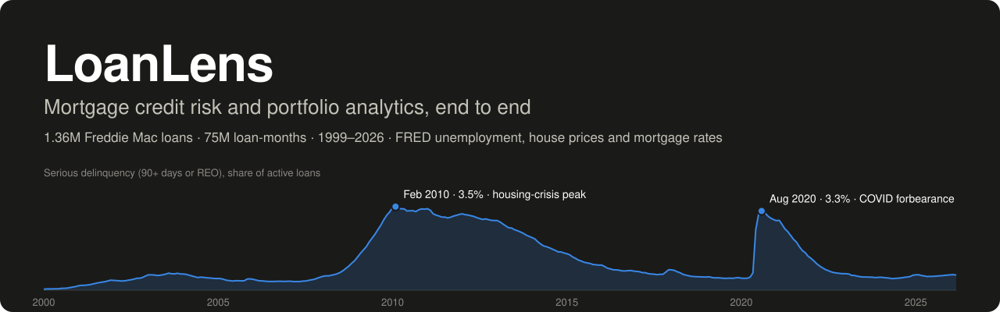
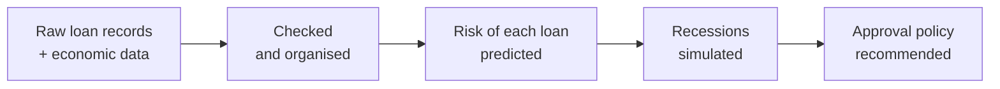
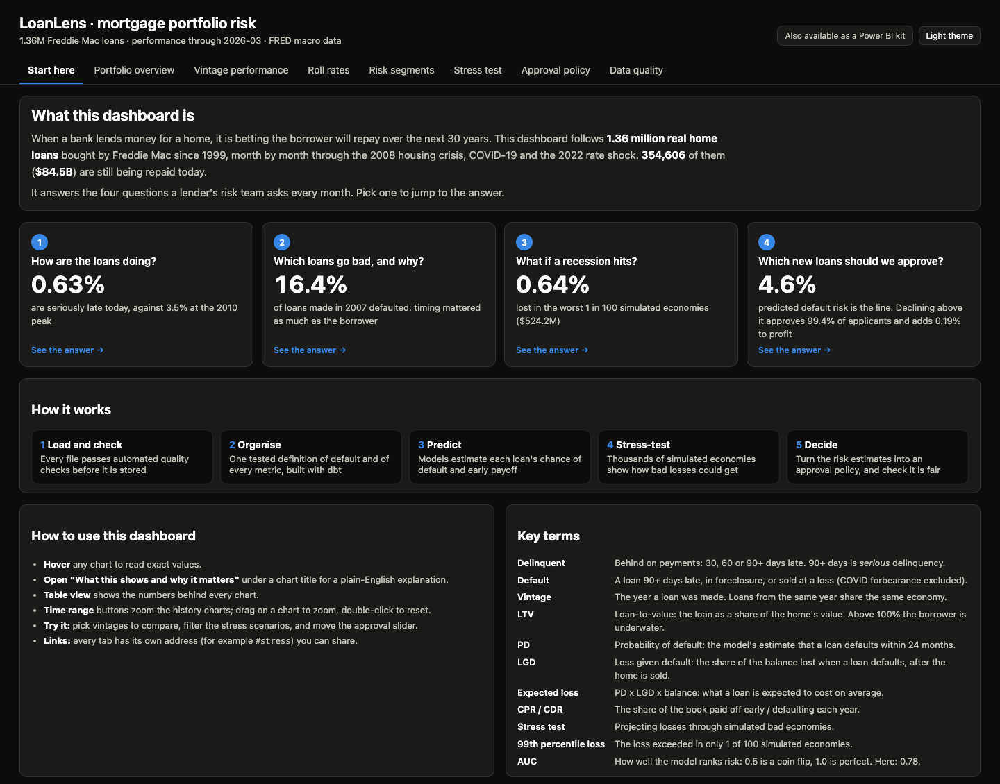
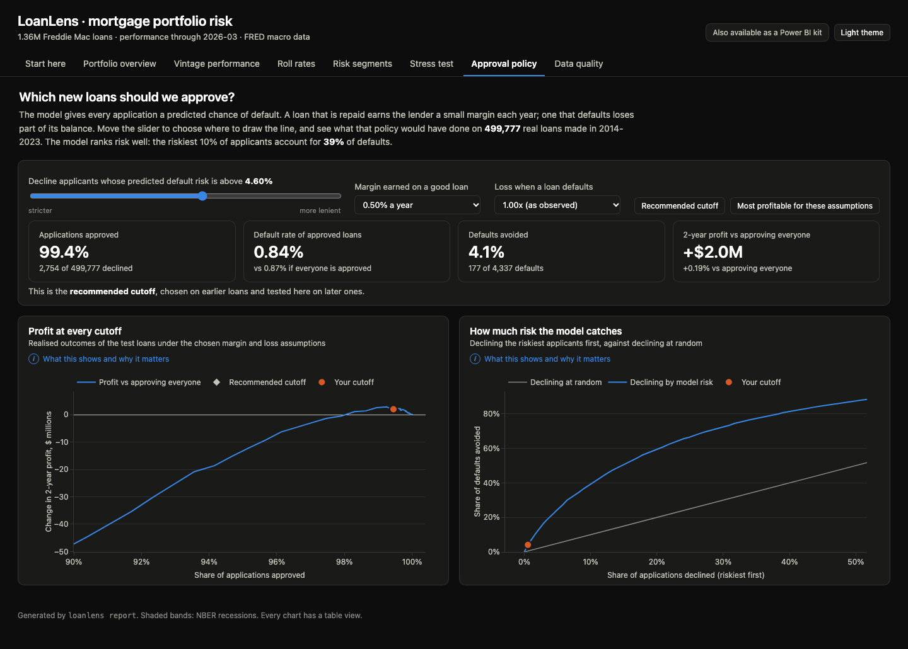
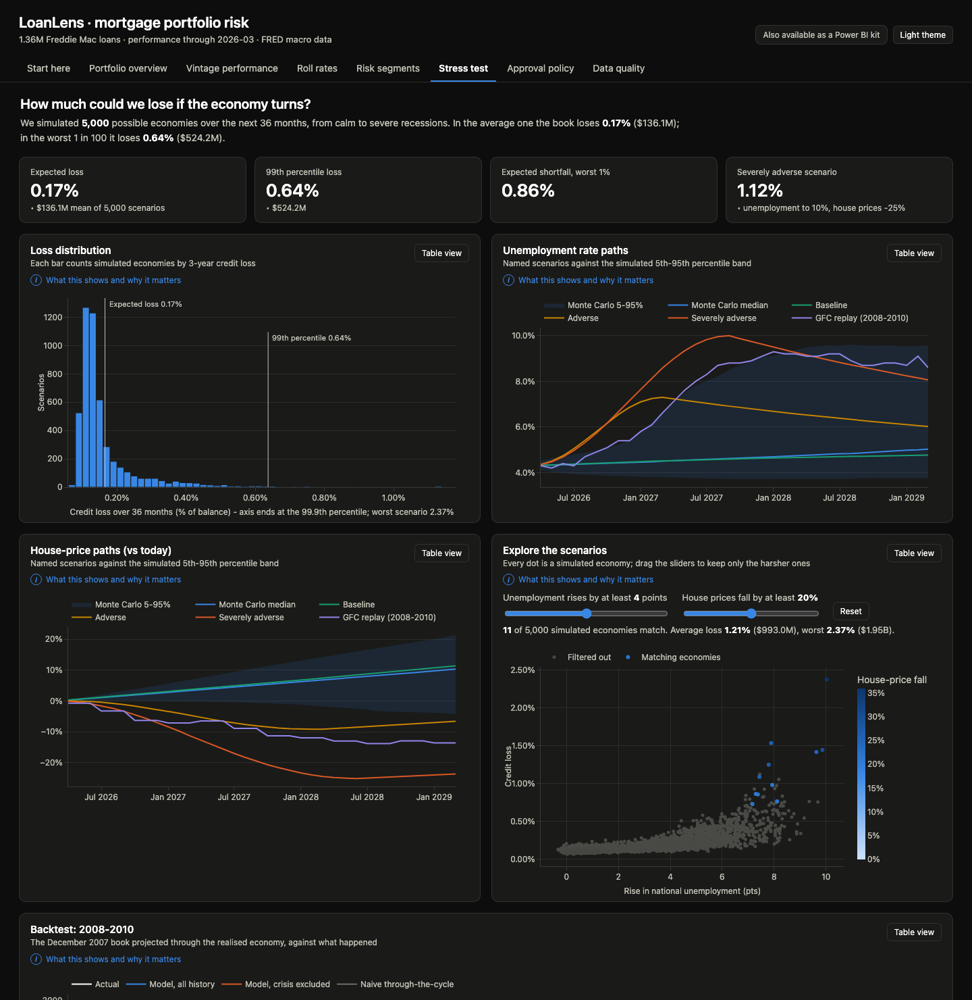
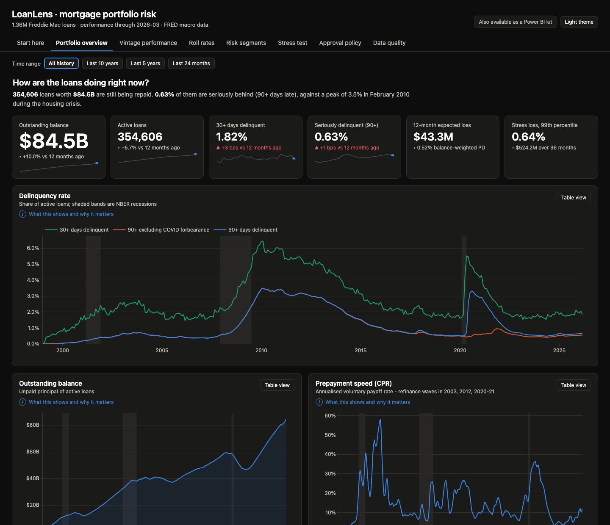
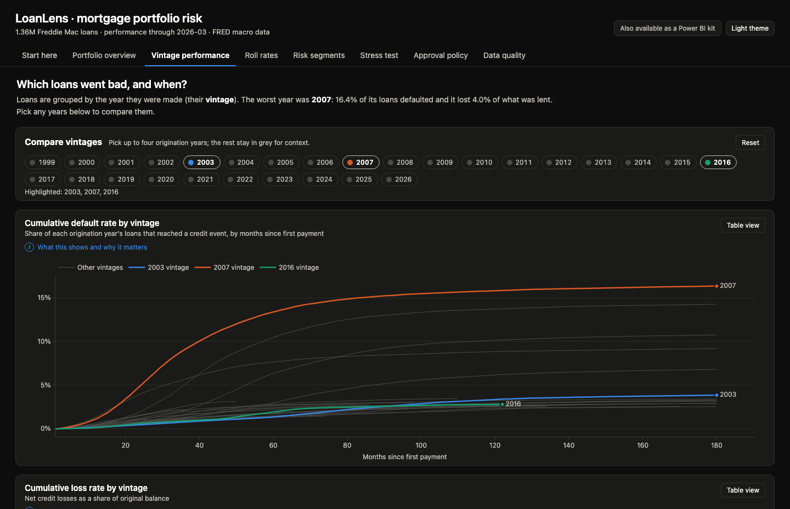
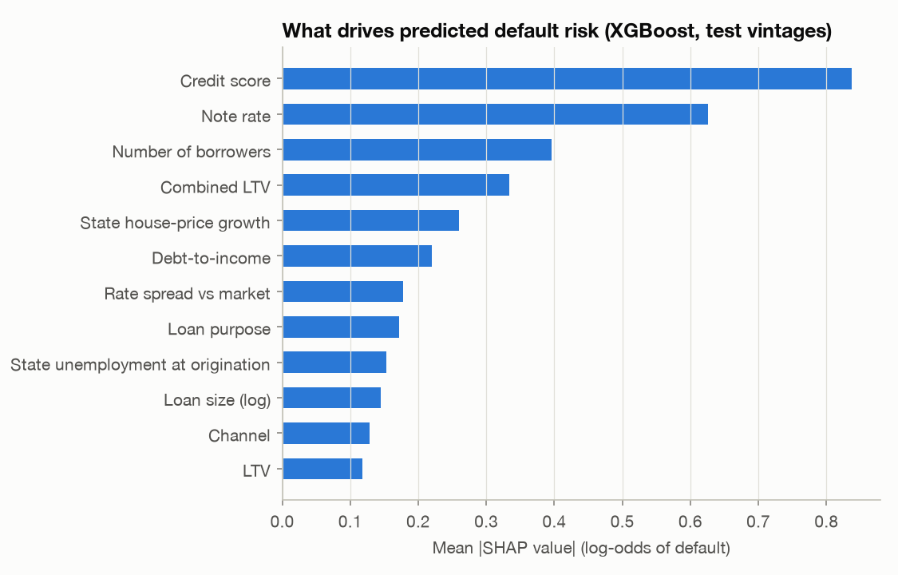
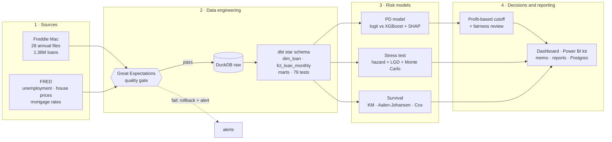

<p align="center">
  
</p>

<p align="center">
  <a href="https://github.com/RajivPraveen/LoanLens/actions/workflows/ci.yml"></a>
  <a href="https://rajivpraveen.github.io/LoanLens/reports/dashboard.html"></a>
  <a href="LICENSE"></a>
  
  
  
  
  
  
  
</p>

<p align="center">
  <a href="#loanlens-in-one-minute"><b>In one minute</b></a> ·
  <a href="#the-four-questions-it-answers"><b>The four questions</b></a> ·
  <a href="#try-it-yourself"><b>Try it</b></a> ·
  <a href="#what-the-data-revealed"><b>Findings</b></a> ·
  <a href="#how-it-works"><b>How it works</b></a> ·
  <a href="#results-in-detail"><b>Results</b></a> ·
  <a href="#run-it"><b>Run it</b></a>
</p>

---

## LoanLens in one minute

When a bank lends someone money for a home, it is making a **30-year bet that the loan will be paid back**.
A bank or mortgage investor holds hundreds of thousands of these bets at once, and every month its
risk team has to decide how worried to be and what to do about it.

**LoanLens is the system that does that job, end to end.** It takes raw loan records and economic data,
checks and organises them, predicts which loans are likely to go bad, simulates what a recession would
cost, and turns all of it into a clear recommendation: which new loans to approve.

It runs on **real data**: 1.36 million mortgages that Freddie Mac bought between 1999 and 2026, each followed
month by month (75 million monthly records) through the 2008 housing crisis, COVID-19 and the 2022 rate shock.



## The four questions it answers

| # | The question a risk team asks | What LoanLens found, in plain words |
|:-:|---|---|
| 1 | **How are our loans doing?** | **0.63%** of borrowers are seriously behind (90+ days late) today. At the worst of the 2008 crisis it was **3.5%**. |
| 2 | **Which loans go bad, and why?** | Loans made in **2007 were 4x as likely to default** as loans made in 2003, though the borrowers had similar credit scores: house prices fell right after they bought. A low credit score is the strongest single warning sign. |
| 3 | **What if a recession hits?** | Across 5,000 simulated economies, the worst 1 in 100 costs **0.64% of the book ($524M of $82B)**. Replayed through the real 2008-2010 crisis, the model's default forecast landed **within 1%** of what actually happened. |
| 4 | **Which new loans should we approve?** | Turn away applicants whose predicted risk of default is **above 4.6%**, about 1 in 180. That avoids 4% of defaults and **adds $2.0M of profit**. Turning away many more would *lose* money, because good borrowers get declined along with the bad. |
| + | **Is the policy fair?** | Approval rates stay **within 1%** across regions, states, first-time buyers, single vs joint borrowers and loan sizes. |

<details>
<summary><b>New to credit risk? Key terms in plain English</b></summary>

<br>

| Term | Meaning |
|---|---|
| Delinquent | Behind on payments: 30, 60 or 90+ days late. 90+ days is *serious* delinquency. |
| Default | A loan that is 90+ days late, in foreclosure, or sold at a loss. |
| Vintage | The year a loan was made. Loans from the same year live through the same economy. |
| LTV (loan-to-value) | The loan as a share of the home's value. Above 100%, the borrower owes more than the home is worth. |
| PD (probability of default) | The model's estimate that a loan will default within 24 months. |
| LGD (loss given default) | The share of the balance lost when a loan defaults, after the home is sold. |
| Expected loss | PD x LGD x balance: what a loan is expected to cost on average. |
| Stress test | Projecting losses through simulated bad economies. |
| 99th-percentile loss | The loss exceeded in only 1 of 100 simulated economies. |
| AUC | How well a model ranks risk: 0.5 is a coin flip, 1.0 is perfect. LoanLens scores 0.78. |
</details>

## What the project is trying to accomplish

**The goal is to show, on real data, the whole chain a lender's credit-risk team runs, from raw files to a
decision a committee could adopt, and to build it the way it would be built for production.**

1. **Turn data into decisions.** Scores and charts are not the end product. The output is a concrete approval
   policy with its profit, its trade-offs and its fairness impact, written up as a
   [one-page memo](reports/lending_memo.md).
2. **Be trustworthy.** Every file is checked before it is stored, a bad delivery can never half-load, and
   every model sits on one tested definition of "default" (79 automated data tests).
3. **Be honest about uncertainty.** Models are judged on years they never saw, the stress test is replayed
   through the real 2008 crisis, and the reports say plainly where the models fall short.

**Why it matters.** Going into 2008, many risk models had only ever seen rising house prices, so they badly
underestimated what a crash would do. LoanLens is built around that lesson: it conditions on the economy
*after* a loan is made, it is tested against the crisis itself, and it measures how wrong it could be.

## Try it yourself

**[Open the live dashboard](https://rajivpraveen.github.io/LoanLens/reports/dashboard.html)**, no install
needed. It starts with a plain-English guide, and every chart has a *"What this shows and why it matters"*
note, a table view and hover tooltips. Three things to try:

| Try this | What you will see |
|---|---|
| **[Move the approval slider](https://rajivpraveen.github.io/LoanLens/reports/dashboard.html#policy)** and change the margin or loss assumptions | Approval rate, defaults avoided and profit update live, on 500,000 real loans the model never trained on |
| **[Filter the stress scenarios](https://rajivpraveen.github.io/LoanLens/reports/dashboard.html#stress)**, e.g. unemployment +4 points and house prices -20% | How many of the 5,000 simulated economies are that bad, and what the book would lose in them |
| **[Pick vintages to compare](https://rajivpraveen.github.io/LoanLens/reports/dashboard.html#vintages)**, e.g. 2007 against 2022 | How each year's loans defaulted and lost money as they aged |

<p align="center"></p>

<details>
<summary><b>More of the dashboard</b>: approval simulator, stress-scenario explorer, portfolio overview</summary>

<br>
<p align="center"></p>
<p align="center"></p>
<p align="center"></p>
</details>

The dashboard is a single self-contained file, [`reports/dashboard.html`](reports/dashboard.html), so it
also works offline. The portfolio, vintage, roll-rate, segment, stress and data-quality pages also ship as a
**Power BI kit** in [`powerbi/`](powerbi/).

---

## What the data revealed

<details open>
<summary><b>1. The 2007 vintage lost ten times as much as 2003, with borrowers who looked similar on paper</b></summary>

<br>

16.4% of loans originated in 2007 reached a credit event (90+ days delinquent, foreclosure or a distressed
sale), and they lost 4.0% of their original balance. Loans from 2003 ended at 4.0% and 0.4%: a quarter of
the defaults and a tenth of the losses. Credit scores were similar (725 vs 732) and debt-to-income was
somewhat higher (37 vs 31), but the bigger difference was timing: 2007 loans were written at the top of
the housing market, then house prices fell and unemployment more than doubled. That is why the stress
model conditions on **house prices and unemployment after origination**, not only on the application.

<p align="center"></p>
</details>

<details>
<summary><b>2. COVID delinquency looked like 2010, but it was not a credit crisis</b></summary>

<br>

Reported serious delinquency jumped to 3.3% in August 2020, as high as the 2010 peak (3.5%). Excluding
loans in COVID forbearance, where borrowers were allowed to pause payments, it was only **0.5%**, and the
2020-2021 vintages have lost almost nothing. LoanLens therefore excludes forbearance from its default
definition and drops the forbearance months when fitting the stress model. Leaving them in would teach
the model that a spike in unemployment is harmless.
</details>

<details>
<summary><b>3. Credit score matters most, but the number of borrowers is third</b></summary>

<br>

SHAP values on the test vintages rank **credit score**, **note rate** and **number of borrowers** as the top
drivers, ahead of loan-to-value and debt-to-income. In the Cox model, single-borrower loans default at
**1.49x** the rate of loans with two or more borrowers, and cash-out refinances at **1.54x**.

<p align="center"></p>
</details>

<details>
<summary><b>4. Recent loans are riskier than the model expects, and the report says so</b></summary>

<br>

The model ranks recent loans well, but it under-predicts their level: 0.48% predicted vs 0.87% observed.
It was recalibrated on 2012-2013 loans, the cleanest in the dataset (0.5% default). The 2019 vintage ran
into COVID, and the 2022-2023 vintages were written at debt-to-income ratios of 37-38 (31-35 for
2009-2021) into a rate shock; those vintages defaulted at 1.2-1.6%. Changing the splits after seeing the test results
would be test-set snooping, so the drift is reported instead, together with a recommendation to
recalibrate on the most recent vintages before production use.
</details>

<details>
<summary><b>5. A stress model that has never seen a crisis does not know how bad one gets</b></summary>

<br>

Fitted on all history, the stress model reproduces 2008-2010 defaults almost exactly (+1%). With every
2007-2010 observation removed, it **overshoots by 48%**: it carries pre-crisis sensitivities into an economy
far outside its data. A naive through-the-cycle rate misses by -69%. The gap between the two fits is a
direct measure of **model uncertainty in the tail**, and the stress report quantifies it rather than hiding it.

<p align="center"></p>
</details>

<details>
<summary><b>6. Real data is messy, and the quality gates caught it</b></summary>

<br>

| What the gates or tests found | How it was handled |
|---|---|
| A 1999 loan with a 36-month term broke the 60-480 month rule | The batch was rolled back and an alert raised; the rule was widened to the observed 30-513 month range |
| 39 monthly records with interest rates of 30-50% (reporting months 2017-03/04), about 10x the prior month | Tolerated by the gate (99.99% threshold), nulled in staging, note rate used instead |
| 2,333 loans (0.17%) in Puerto Rico, Guam and the U.S. Virgin Islands | Kept in raw, excluded from modelling (FRED has no local macro series for them) |
| Short sales whose "removed balance" is a written-down residual of a few cents | Loss severity measured against the balance at default instead |
| 756 liquidations that ended in a small net gain | Vintage-curve test allows net-loss dips of up to 1 basis point |
| Performance records start one month before the first payment | Date dimension and timing tests follow Freddie Mac's convention |
</details>

---

## How it works



| Phase | What happens | Why it matters |
|---|---|---|
| **1. Ingest** | Each file is fingerprinted (SHA-256), parsed in its detected layout (Release 47 or older), validated in chunks by Great Expectations, and loaded in a single transaction | A bad or re-delivered file can never half-load or duplicate rows |
| **2. Model the data** | dbt builds a star schema: a loan dimension, an incremental loan-by-month fact table, and marts for delinquency, prepayment speed, vintage curves, roll rates, risk segments and losses | One tested definition of "default" feeds every model and chart |
| **3. Predict** | Out-of-time PD models with calibration and reason codes; survival models for the timing of default and prepayment | Estimates hold up on future loans, not just the past |
| **4. Stress** | Default and prepayment hazard models driven by the economy, an LGD model, and a Monte Carlo scenario generator; backtested on 2008-2010 | Answers "how bad could it get?", with an honest error bar |
| **5. Decide** | Profit-maximising approval cutoff, sensitivity to margin and severity, fair-lending review, one-page memo | Turns model output into a policy a committee can adopt |

Everything is orchestrated by **Dagster** (assets, a monthly schedule, a sensor for new files, retries and
failure alerts) and is also available as a `loanlens` command-line tool.

---

## Results in detail

<table>
<tr>
<td align="center" width="25%"><h2>1.36M</h2>real loans · 75M loan-months<br><sub>28 files, 1999-2026, 100% of loaded data passed 1,776 quality checks</sub></td>
<td align="center" width="25%"><h2>0.783</h2>out-of-time AUC (XGBoost)<br><sub>vs 0.737 logistic regression; 95% CI 0.777-0.790</sub></td>
<td align="center" width="25%"><h2>0.64%</h2>99th-percentile stress loss<br><sub>$524M over 36 months; expected loss 0.17%</sub></td>
<td align="center" width="25%"><h2>+1%</h2>2008-2010 backtest error<br><sub>projected 6.57% defaults vs 6.53% actual</sub></td>
</tr>
</table>

| Area | Result (Freddie Mac Sample, performance through March 2026) |
|---|---|
| Data engineering | 1,362,500 loans and 74,937,616 monthly records ingested incrementally; the quality gates **stopped one real batch** (a 36-month loan term in 1999) before it could load; 78 of 79 dbt tests pass, with 1 deliberate warning for outlier loss severities |
| Default model (tested on 2014-2023 vintages) | **XGBoost AUC 0.783** vs **logistic regression 0.737** (+0.046); top decile captures 39.4% of defaults (lift 3.9x) |
| Survival | Cox concordance 0.828 for default; a time-varying Cox model shows how unemployment, negative equity and the refinance incentive move default and prepayment risk month by month |
| Stress test (performing book as of 2026-03: 343,920 loans, $82.3B) | Expected loss **0.17%**, 99th percentile **0.64%**, expected shortfall **0.86%**; CCAR-style severely adverse scenario (unemployment 10%, house prices -25%) **1.12%** |
| Backtest (December 2007 book through the real 2008-2010 economy) | Production model: defaults **+1%**, losses -7% vs actual. With the crisis removed from fitting: **+48%** (overshoots). Naive through-the-cycle benchmark: **-69%** |
| Approval policy | Decline PD > 4.60%: approves 99.4%, avoids 4.1% of defaults, **+0.19% profit ($2.0M)** on later vintages; larger gains if margins are thinner (+4.5% at a 0.25% margin) |
| Fair lending | Minimum adverse impact ratio **0.992** (four-fifths rule: 0.80). One flag: the PD under-states Florida's risk relative to other states |

Every number above is regenerated by `loanlens report` in [reports/results_summary.md](reports/results_summary.md).

### Reports

| Report | What it covers |
|---|---|
| [Lending memo](reports/lending_memo.md) | One page for the credit committee: the recommended cutoff, its profit and trade-offs, risks |
| [Default model](reports/model_report.md) | Out-of-time design, metrics, calibration, stability by vintage, SHAP drivers |
| [Survival analysis](reports/survival_report.md) | Kaplan-Meier, cumulative incidence by era, Cox and time-varying Cox |
| [Stress test](reports/stress_test_report.md) | Loss distribution, named scenarios, loss drivers, 2008-2010 backtest |
| [Fairness review](reports/fairness_review.md) | Approval rates, adverse impact ratios, calibration and AUC by group |

---

## Run it

**1. Set up** (Python 3.11 via [uv](https://docs.astral.sh/uv/)):

```bash
make setup        # creates .venv and installs everything (+ a macOS libomp fix for XGBoost)
```

**2. Get the data.** Freddie Mac requires a free account, and its terms do not allow redistributing the
files. At [freddiemac.com](https://www.freddiemac.com/research/datasets/sf-loanlevel-dataset), under
**Standard Dataset Download by Year**, download the *sample* file for each year (`sample_1999.zip` ...
`sample_2026.zip`, about 1.1 GB in total) and put them, still zipped, in `data/raw/freddie/`.

**3. Run everything:**

```bash
make all          # FRED -> ingest + quality gates -> dbt -> models -> stress test -> reports
open reports/dashboard.html
```

The first run takes about 20 minutes on a laptop (the ingest with full validation is about 10 of those);
reruns skip unchanged files and take about 6 minutes.

<details>
<summary><b>Other ways to run it</b></summary>

<br>

| | |
|---|---|
| Step by step | `loanlens fetch-fred \| ingest \| transform \| train \| survival \| stress \| decide \| fairness \| report` |
| Health check | `loanlens status` (load history and data-quality pass rates) |
| Orchestrated | `make dagster`, then open http://localhost:3000 and materialize all assets |
| Docker | `docker compose run --rm pipeline` |
| PostgreSQL serving layer | `docker compose up -d postgres && make publish` |
| Full dataset (~50M loans) | Ingest on Spark/Databricks with [`spark/freddie_ingest_spark.py`](spark/freddie_ingest_spark.py) |
| Tests | `make test`: unit tests, quality gates, idempotency, and an end-to-end run on a small synthetic dataset (CI cannot ship the licensed files; synthetic data is never used for results) |

Operations, failure handling and the real-data quirks are in the [runbook](docs/runbook.md).
</details>

---

## Deep dives

<details>
<summary><b>Data engineering</b>: incremental loads, quality gates, star schema, orchestration</summary>

<br>

- **Incremental and idempotent.** Each source file is fingerprinted; unchanged files are skipped, and a
  changed file replaces its period inside one transaction (delete + insert), so reruns never duplicate
  rows. The dbt staging and fact tables are incremental on the same key.
- **Quality gates.** Great Expectations suites check keys, uniqueness, value ranges (credit score 300-850,
  rates, LTV, DTI), code sets, date formats and loan-to-performance referential integrity on every chunk.
  Any failure rolls back the period, writes an alert (log, JSON, optional Slack/Teams webhook) and stops the run.
- **Star schema (dbt).** `dim_loan`, the incremental `fct_loan_monthly` (loan x month, 75M rows),
  `dim_macro` (state x month), `dim_date`, `dim_geography`, and marts for delinquency, CPR/CDR, vintage
  curves, roll-rate matrices, risk segments, losses and data quality. 79 generic and singular tests,
  e.g. roll rates sum to one, no activity after termination, the portfolio mart reconciles to the fact table.
- **Scale.** DuckDB runs with a bounded memory limit and spills to disk, so a 16 GB laptop handles 75M
  loan-months. A PySpark job does the same ingestion with Delta partition overwrites for the full dataset.
- **Orchestration.** Dagster assets for every step and every dbt model and test, a schedule, a new-file
  sensor, retries and a run-failure alert. CI (GitHub Actions) runs lint, dbt parse, the tests and a Dagster load check.

Design notes: [docs/architecture.md](docs/architecture.md) · schema: [docs/data_dictionary.md](docs/data_dictionary.md)
</details>

<details>
<summary><b>Credit-risk models</b>: PD, survival, explainability</summary>

<br>

- **Target:** a credit event within 24 months of the first payment (90+ days delinquent outside COVID
  forbearance, REO, or a loss-generating termination).
- **Out-of-time splits:** train on 1999-2011 vintages (648k loans), recalibrate on 2012-2013 (100k), test on
  2014-2023 (500k). Random splits would leak the economy between train and test.
- **Models:** logistic regression baseline vs XGBoost with monotone constraints on credit score, LTV,
  CLTV and DTI; logistic recalibration; bootstrap confidence intervals for AUC. State identity is
  deliberately excluded (fair-lending proxy risk).
- **Explainability:** SHAP global importance and per-loan top-3 risk drivers (the basis for adverse-action
  reason codes).
- **Survival:** Kaplan-Meier by credit band, Aalen-Johansen cumulative incidence for competing risks,
  cause-specific Cox with proportional-hazards tests, and a time-varying Cox model with quarterly macro covariates.

Metric definitions: [docs/metric_definitions.md](docs/metric_definitions.md)
</details>

<details>
<summary><b>Stress testing</b>: hazard models, scenarios, backtest</summary>

<br>

- **Hazard models:** discrete-time logistic models for monthly default and prepayment, fitted on 4.9M
  loan-months with mark-to-market LTV, state unemployment and its 12-month change, the refinance
  incentive and loan attributes. COVID forbearance months are excluded from fitting.
- **LGD:** loss given default by LTV band and mortgage insurance, priced at the expected liquidation date
  (18 months after default) because crisis losses came from prices that kept falling after default.
- **Scenarios:** 5,000 simulated 36-month economies (expansion dynamics estimated since 1990, a recession
  regime at 14% a year, state betas) plus Baseline, Adverse, Severely adverse and a 2008-2010 replay.
- **Projection:** competing-risk run-off of a 10,000-loan sample of the performing book, scaled to the book.
- **Backtest:** the December 2007 book projected through the realised 2008-2010 economy, in-sample,
  out-of-sample and against a naive benchmark.
</details>

<details>
<summary><b>Decision and fairness</b>: profit-based cutoff, fair-lending review</summary>

<br>

- **Profit per loan:** balance x net margin (0.50% a year) x 2 years x (1 - PD) - PD x LGD x balance.
  The cutoff that maximises profit is chosen on the calibration vintages and evaluated on the test vintages
  with their *actual* outcomes, so the reported uplift is out-of-sample.
- **Sensitivity:** thinner margins or 1.5x severity move the cutoff down and raise the uplift, up to +18%.
- **Fair lending:** adverse impact ratio (four-fifths rule), calibration relative to the overall level,
  and AUC by census region, largest states, first-time buyers, number of borrowers and loan size, under
  the recommended cutoff and a strict 10%-decline policy.
</details>

<details>
<summary><b>Project layout</b></summary>

<br>

```
config/loanlens.yaml        settings; profiles: freddie (default, real data), tiny (tests only)
data/raw/freddie/           Freddie Mac zips (not in git) · data/raw/fred/ FRED cache
src/loanlens/
  ingest/                   Freddie Mac incremental loader, FRED client
  quality/                  Great Expectations suites + validation runner
  models/                   PD model, survival analysis, fairness review
  stress/                   hazard + LGD models, scenario generator, projection engine
  decision/                 profit-maximising approval cutoff
  reporting/                reports, memo, dashboard, banner, Power BI export, Postgres publish
  orchestration/            Dagster definitions
  synthetic/                Freddie-layout generator for the test suite only
  cli.py, pipeline.py       the `loanlens` command line
dbt/                        staging -> core star schema -> marts -> reporting (+ tests, seeds)
spark/                      Databricks / Spark ingestion job
powerbi/                    Power BI theme, DAX measures, Power Query, build guide
reports/                    generated reports, figures and dashboard
tests/                      pytest suite
docs/                       architecture, data dictionary, metrics, assumptions, runbook
```
</details>

---

## Deliverables

| Deliverable | Where |
|---|---|
| Data pipeline and dbt data model | [`src/loanlens/ingest`](src/loanlens/ingest), [`dbt/`](dbt), [`src/loanlens/orchestration`](src/loanlens/orchestration) |
| Default-prediction and time-to-default/prepayment models | [model report](reports/model_report.md), [survival report](reports/survival_report.md) |
| Monte Carlo stress-testing report | [stress test report](reports/stress_test_report.md) |
| Portfolio risk dashboard | [`reports/dashboard.html`](reports/dashboard.html), [`powerbi/`](powerbi) |
| One-page lending recommendation memo | [lending memo](reports/lending_memo.md) |
| Data dictionary and metric definitions | [data dictionary](docs/data_dictionary.md), [metric definitions](docs/metric_definitions.md) |
| Assumptions and limitations | [assumptions and limitations](docs/assumptions_and_limitations.md) |

## Tools

Python 3.11 · SQL · DuckDB · dbt · Great Expectations · Dagster · Spark (Databricks) · PostgreSQL ·
scikit-learn · XGBoost · lifelines · SHAP · Plotly · matplotlib · Power BI · Docker · GitHub Actions

## Limitations

- **Approved agency loans only.** Freddie Mac data covers conforming loans it bought, so there is no
  reject inference: the cutoff's effect on applicants who were declined elsewhere is unknown. Pilot it first.
- **A sample, not the population.** 50,000 loans per year are a random sample of the full dataset; thin
  segments (small states, rare products) are noisy.
- **No protected-class fields.** There is no race, ethnicity, sex or age data, so the fairness review covers
  geography, first-time buyers, number of borrowers and loan size. A full review needs HMDA data or BISG proxies.
- **Associations, not causes,** and the stress distribution reflects macro uncertainty only; see the backtest
  for model uncertainty. Full list: [docs/assumptions_and_limitations.md](docs/assumptions_and_limitations.md).

<sub>Data: Freddie Mac Single-Family Loan-Level Dataset (Sample, Release 47) and FRED, Federal Reserve Bank of St. Louis.
The Freddie Mac files are not included in this repository.</sub>
