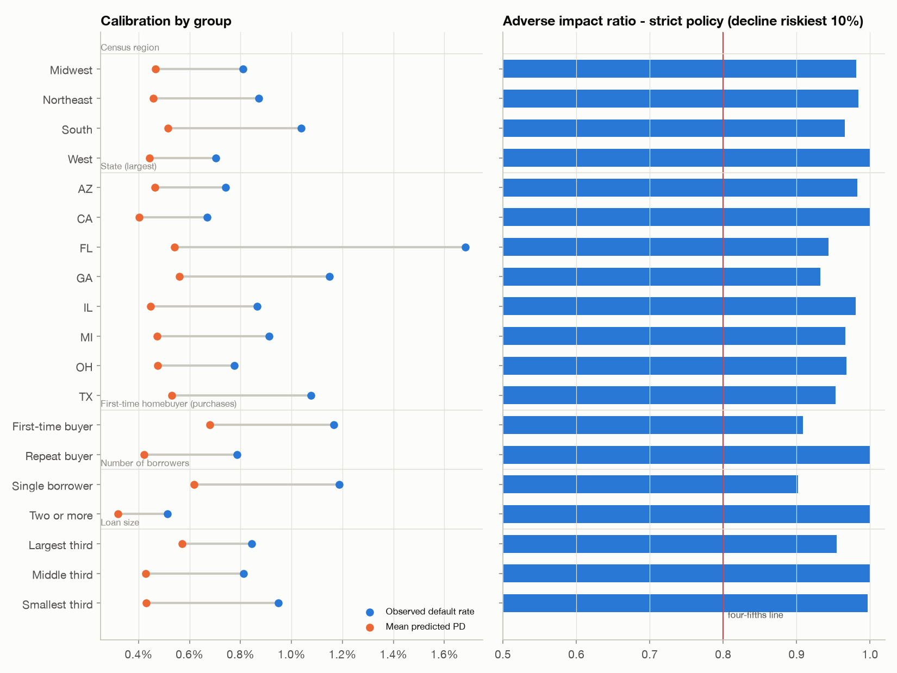

# Fair-lending review: origination default model

*Generated by `loanlens fairness` - profile `freddie`. Out-of-time test vintages.*

## Scope and limits

Freddie Mac loan-level data has **no race, ethnicity, sex or age fields**, so outcomes for
ECOA/Fair Housing Act protected classes cannot be measured here; a full fair-lending analysis would join
HMDA data (or use BISG proxies) and include a less-discriminatory-alternative search. This review covers
the groups the data identifies: geography, first-time buyers, single vs multiple borrowers (related to
marital status, a protected basis) and loan size (an income/wealth proxy).

The model excludes state and region identity as features by design; local economic conditions enter only
through state unemployment and house-price growth at origination.

## Thresholds

- Adverse impact ratio (AIR) below **0.80** (four-fifths rule of thumb).
- Relative calibration outside **0.67-1.50**, for groups with >= 20 defaults: the group's calibration ratio
  (mean PD / observed default rate) divided by the overall ratio (0.55). A shift that
  moves every group together is a model-level calibration issue (see the model report), not a disparity.
- Group AUC more than **0.05** below the overall AUC (0.783).

Two decision policies are tested: the **recommended** cutoff (PD > 4.60% declined) and a
**strict** policy declining the riskiest 10% (PD > 1.10%).

## Findings

- State (largest) / FL: relative calibration 0.59 (calibration ratio 0.32 vs 0.55 overall; PD under-states this group's risk relative to others)

Minimum AIR: **0.992** under the recommended cutoff, **0.902** under the strict policy.

| dimension | group | loans | default_rate | mean_pd | calibration_ratio | relative_calibration | auc | approval_recommended | air_recommended | approval_strict | air_strict | false_decline_strict |
|:---|:---|---:|---:|---:|---:|---:|---:|---:|---:|---:|---:|---:|
| Census region | Midwest | 113,982 | 0.81% | 0.47% | 0.58 | 1.05 | 0.795 | 99.6% | 1.00 | 90.0% | 0.98 | 9.7% |
| Census region | Northeast | 67,337 | 0.87% | 0.46% | 0.53 | 0.96 | 0.786 | 99.7% | 1.00 | 90.3% | 0.98 | 9.5% |
| Census region | South | 175,982 | 1.04% | 0.52% | 0.50 | 0.91 | 0.777 | 99.4% | 1.00 | 88.5% | 0.97 | 11.2% |
| Census region | West | 142,476 | 0.70% | 0.44% | 0.63 | 1.15 | 0.773 | 99.3% | 1.00 | 91.7% | 1.00 | 8.1% |
| State (largest) | AZ | 16,067 | 0.74% | 0.46% | 0.63 | 1.14 | 0.776 | 99.2% | 0.99 | 91.2% | 0.98 | 8.6% |
| State (largest) | CA | 62,148 | 0.67% | 0.40% | 0.60 | 1.09 | 0.763 | 99.4% | 1.00 | 92.8% | 1.00 | 7.0% |
| State (largest) | FL | 34,077 | 1.68% | 0.54% | 0.32 | 0.59 | 0.751 | 99.3% | 1.00 | 87.6% | 0.94 | 12.0% |
| State (largest) | GA | 16,025 | 1.15% | 0.56% | 0.49 | 0.89 | 0.802 | 99.2% | 0.99 | 86.6% | 0.93 | 13.0% |
| State (largest) | IL | 22,179 | 0.87% | 0.45% | 0.52 | 0.94 | 0.780 | 99.6% | 1.00 | 91.0% | 0.98 | 8.8% |
| State (largest) | MI | 18,404 | 0.91% | 0.47% | 0.52 | 0.94 | 0.802 | 99.7% | 1.00 | 89.7% | 0.97 | 10.0% |
| State (largest) | OH | 18,054 | 0.78% | 0.47% | 0.61 | 1.11 | 0.781 | 99.6% | 1.00 | 89.8% | 0.97 | 9.9% |
| State (largest) | TX | 39,013 | 1.08% | 0.53% | 0.49 | 0.90 | 0.760 | 99.2% | 0.99 | 88.4% | 0.95 | 11.3% |
| First-time homebuyer (purchases) | First-time buyer | 106,827 | 1.17% | 0.68% | 0.58 | 1.06 | 0.778 | 99.0% | 0.99 | 83.4% | 0.91 | 16.2% |
| First-time homebuyer (purchases) | Repeat buyer | 392,938 | 0.79% | 0.42% | 0.53 | 0.97 | 0.781 | 99.6% | 1.00 | 91.8% | 1.00 | 8.0% |
| Number of borrowers | Single borrower | 262,750 | 1.19% | 0.62% | 0.52 | 0.95 | 0.749 | 99.2% | 0.99 | 85.6% | 0.90 | 14.1% |
| Number of borrowers | Two or more | 237,027 | 0.51% | 0.32% | 0.62 | 1.13 | 0.799 | 99.8% | 1.00 | 94.9% | 1.00 | 5.0% |
| Loan size | Largest third | 166,592 | 0.84% | 0.57% | 0.68 | 1.23 | 0.779 | 98.9% | 0.99 | 87.3% | 0.95 | 12.4% |
| Loan size | Middle third | 166,592 | 0.81% | 0.43% | 0.53 | 0.96 | 0.779 | 99.7% | 1.00 | 91.5% | 1.00 | 8.3% |
| Loan size | Smallest third | 166,593 | 0.95% | 0.43% | 0.45 | 0.83 | 0.792 | 99.7% | 1.00 | 91.2% | 1.00 | 8.5% |

## Interpretation

- Under the recommended cutoff almost every applicant is approved, so approval-rate disparities are negligible.
- A strict policy concentrates declines where observed risk is higher (e.g. single-borrower and small-balance
  loans). Where a group's AIR approaches the four-fifths line, the disparity must be justified by business
  necessity (the calibration columns show whether the higher PD reflects genuinely higher observed defaults)
  and a less discriminatory alternative should be sought - for example risk-based pricing or compensating
  factors instead of a hard decline.
- Calibration within groups shows whether a group's risk is over- or under-stated; a model that systematically
  over-predicts risk for a group would unfairly penalise it even at a fixed cutoff.

Findings are associations in historical data, not evidence of intent, and are documented for model-risk review.
