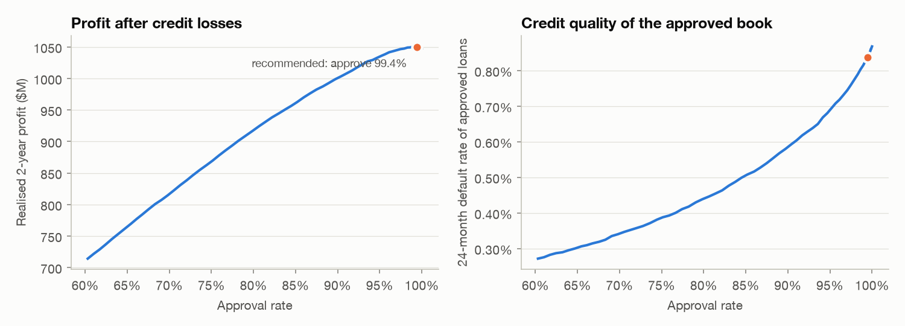

# Memo: approval cutoff for new mortgage originations

**To:** Credit Risk Committee  **From:** Portfolio Analytics (LoanLens)  **Re:** PD-based approval cutoff

*Based on the Freddie Mac Single-Family Loan-Level Sample (Release 47), with out-of-sample test vintages.*

**Recommendation.** Decline applications whose predicted 24-month default probability exceeds
**4.60%**. On the out-of-sample test vintages this approves **99.4%** of loans
(declines 2,754 of 499,777), removes **4.1% of defaults**, lowers the
approved book's default rate from 0.87% to **0.84%**, and raises
2-year profit after credit losses by **0.19%** ($2.0M)
while giving up 0.8% of origination volume.

**Why.** A loan earns its net credit margin (0.50% a year - a guarantee-fee-style spread
net of servicing and capital costs) while it performs and loses
its balance times loss severity when it defaults. Approving is profitable only while
PD < margin x horizon / (margin x horizon + severity) - about **4.6%** at average
severity. The calibrated model finds a thin tail of applications above that line; the rest of the book is
already profitable, so the right move is a targeted decline of the tail, not a broad tightening.

| Trade-off (test vintages) | | | | | |
|---|---:|---:|---:|---:|---:|
| Approve all (today) | 32.72% | 100.0% | 0.87% | $1,047.9M | +0.00% |
| Approve 99.5% | 4.77% | 99.5% | 0.84% | $1,049.8M | +0.18% |
| **Recommended** | 4.60% | 99.4% | 0.84% | $1,049.9M | +0.19% |
| Approve 99.0% | 3.49% | 99.0% | 0.81% | $1,050.5M | +0.24% |
| Approve 97.9% | 2.55% | 97.9% | 0.78% | $1,047.5M | -0.05% |
| Approve 95.2% | 1.68% | 95.2% | 0.69% | $1,035.9M | -1.15% |
| Approve 89.7% | 1.08% | 89.7% | 0.58% | $998.8M | -4.69% |

Columns: PD cutoff, approval rate, default rate of approved loans, realised 2-year profit, change vs approving all.
Tightening further (e.g. approving 90%) *reduces* profit: it declines many loans that would have been profitable.

**How robust is it?** The cutoff was chosen on calibration vintages [2012, 2013] and evaluated on test vintages [2014, 2023] with their actual
default outcomes. Under lower margins or 1.5x loss severity the optimal cutoff falls and the uplift grows:

| Net margin | Severity x | Cutoff | Approval | Profit uplift |
|---:|---:|---:|---:|---:|
| 0.25% | 1.0x | 2.32% | 97.5% | +4.46% |
| 0.25% | 1.5x | 1.59% | 94.7% | +18.18% |
| 0.33% | 1.0x | 3.09% | 98.6% | +1.42% |
| 0.33% | 1.5x | 2.01% | 96.6% | +7.03% |
| 0.50% | 1.0x | 4.60% | 99.4% | +0.19% |
| 0.50% | 1.5x | 3.09% | 98.6% | +1.42% |
| 0.67% | 1.0x | 6.21% | 99.7% | +0.02% |
| 0.67% | 1.5x | 4.40% | 99.4% | +0.35% |

**Risks and caveats.** (1) The model has only seen approved agency loans - declined-applicant performance is
unknown (no reject inference), so the cutoff should be piloted before full rollout. (2) Profit uses a simple
margin and a 2-year horizon; prepayment timing and funding costs are not modelled. (3) A cutoff changes who
is approved - see the fair-lending review (`fairness_review.md`) for approval-rate impact by region and
borrower group before adoption. (4) Recalibrate quarterly: the PD level shifts with the economy. On the test vintages the PD averages 0.48% against 0.87% observed: the ranking holds, but the level is low, so the profit figures above (which use actual outcomes) are reliable while the PD cutoff itself should be re-derived after recalibration.

**Next steps.** Pilot the cutoff on one channel for a quarter, track declined-applicant outcomes where
available, and pair it with risk-based pricing for loans just below the line.
