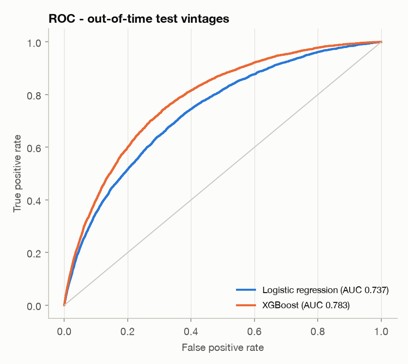
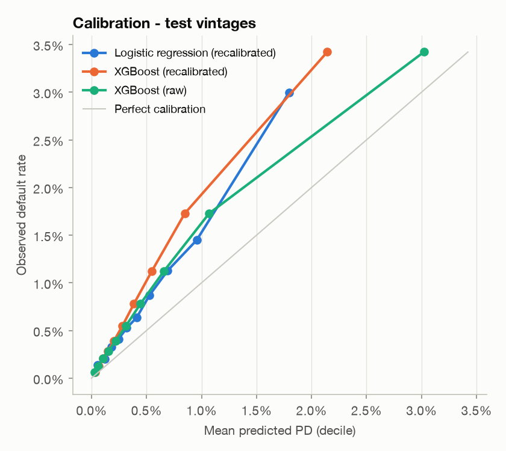
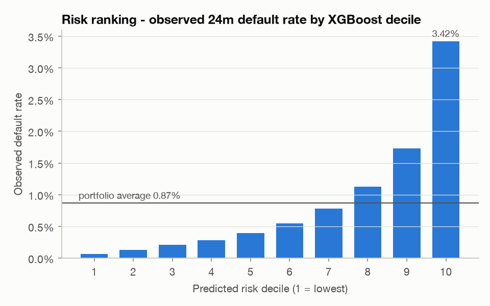
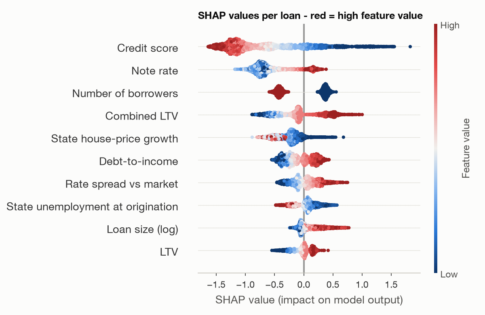

# Default model report

*Generated by `loanlens train` - profile `freddie`.*

**Target:** credit event within **24 months** of first payment - 90+ days
delinquent outside COVID forbearance, REO, or a loss-generating termination (short sale,
third-party sale, REO disposition, note sale).

## Out-of-time design

Loans are split by origination year, never at random, so the test set is strictly later
than anything the models saw. Only loans whose full 24-month window is
observed are used.

| Split | Vintages | Loans | Defaults | Default rate |
|:---|:---|:---|:---|---:|
| train | 1999-2011 | 647,959 | 9,687 | 1.50% |
| calibration | 2012-2013 | 99,928 | 516 | 0.52% |
| test | 2014-2023 | 499,777 | 4,337 | 0.87% |

The training vintages include the 2005-2008 crisis cohorts, so their base rate is far above
the later vintages. Both models are **recalibrated** (logistic recalibration of the raw score)
on the calibration vintages so predicted PDs reflect the current regime; this is monotone
and leaves ranking metrics unchanged.

## Results on test vintages

| Model | AUC | PR-AUC | KS | Brier | ECE | Mean PD | Precision top 10% | Recall top 10% |
|:---|---:|---:|---:|---:|---:|---:|---:|---:|
| Logistic regression (baseline) | 0.737 | 0.026 | 0.349 | 0.00856 | 0.34% | 0.53% | 3.00% | 34.52% |
| XGBoost | 0.783 | 0.033 | 0.432 | 0.00853 | 0.39% | 0.48% | 3.42% | 39.43% |
| Logistic regression - raw | 0.737 | 0.026 | 0.349 | 0.00870 | 0.41% | 1.17% | 3.00% | 34.52% |
| XGBoost - raw | 0.783 | 0.033 | 0.432 | 0.00853 | 0.26% | 0.61% | 3.42% | 39.43% |

- **XGBoost AUC 0.783** (95% bootstrap CI 0.777-0.790) vs
  **logistic regression 0.737** (0.731-0.745): a difference of
  +0.046 AUC points.
- Observed test default rate 0.87% vs mean predicted PD
  0.48% (XGBoost, recalibrated) and 0.61% raw -
  here the raw scores are closer. The calibration vintages (2012-2013, default rate 0.52%) were unusually clean, while later vintages were riskier, so the recalibrated PDs **under-predict** the test level. Ranking is unaffected; before production use, recalibrate on the most recent fully observed vintages.
- The riskiest 10% of test loans capture 39.4% of defaults
  (lift 3.9x).

## Stability by test vintage

| vintage_year | loans | default_rate | mean_pd_xgb | auc_lr | auc_xgb |
|---:|---:|---:|---:|---:|---:|
| 2014 | 49,959 | 0.48% | 0.39% | 0.795 | 0.827 |
| 2015 | 49,982 | 0.45% | 0.34% | 0.792 | 0.823 |
| 2016 | 49,985 | 0.61% | 0.35% | 0.774 | 0.789 |
| 2017 | 49,987 | 0.72% | 0.43% | 0.783 | 0.800 |
| 2018 | 49,980 | 0.74% | 0.52% | 0.756 | 0.776 |
| 2019 | 49,986 | 1.22% | 0.48% | 0.692 | 0.716 |
| 2020 | 49,988 | 0.74% | 0.25% | 0.722 | 0.742 |
| 2021 | 49,979 | 0.63% | 0.23% | 0.735 | 0.780 |
| 2022 | 49,980 | 1.51% | 0.59% | 0.721 | 0.757 |
| 2023 | 49,951 | 1.56% | 1.17% | 0.770 | 0.775 |

The largest level gaps are 2022 (1.51% observed vs 0.59% predicted), 2019 (1.22% observed vs 0.48% predicted), 2020 (0.74% observed vs 0.25% predicted). Vintages whose first 24 months overlap a shock (loans originated in 2019-2020 ran into COVID; 2022-2023 loans were written at higher debt-to-income ratios into a rate shock)
default above prediction - an origination-only model cannot see post-origination economics. That is what the macro-conditional hazard model in the
stress-testing module is for.

## Explainability

Global drivers (mean |SHAP| on a test sample, one-hot columns summed back to the feature):

| feature | mean_abs_shap |
|:---|---:|
| Credit score | 0.8369 |
| Note rate | 0.6263 |
| Number of borrowers | 0.3960 |
| Combined LTV | 0.3337 |
| State house-price growth | 0.2597 |
| Debt-to-income | 0.2199 |
| Rate spread vs market | 0.1781 |
| Loan purpose | 0.1719 |
| State unemployment at origination | 0.1526 |
| Loan size (log) | 0.1451 |

Every scored loan also carries its top three risk-increasing drivers (`risk_driver_1..3`,
from TreeSHAP) - the basis for adverse-action style reason codes.

Largest logistic-regression coefficients (standardised numeric features):

| feature | coefficient | odds_ratio_per_sd |
|:---|---:|---:|
| loan_purpose_Purchase | -1.142 | 0.32 |
| occupancy_Primary | -0.937 | 0.39 |
| channel_Correspondent | -0.860 | 0.42 |
| property_type_Condo | -0.807 | 0.45 |
| channel_Retail | -0.786 | 0.46 |
| property_type_PUD | -0.783 | 0.46 |
| loan_purpose_No cash-out refinance | -0.745 | 0.47 |
| occupancy_Second home | -0.725 | 0.48 |
| credit_score | -0.699 | 0.50 |
| occupancy_Investment | -0.697 | 0.50 |

## Caveats

- Freddie Mac data only contains **approved, agency-conforming** loans; the model has never
  seen rejected applicants (no reject inference), so it ranks risk *within* an approved-like
  population.
- Results show associations, not causal effects.
- XGBoost is constrained to be monotone in credit score, LTV, CLTV and DTI so its behaviour
  is explainable and consistent with credit policy.
