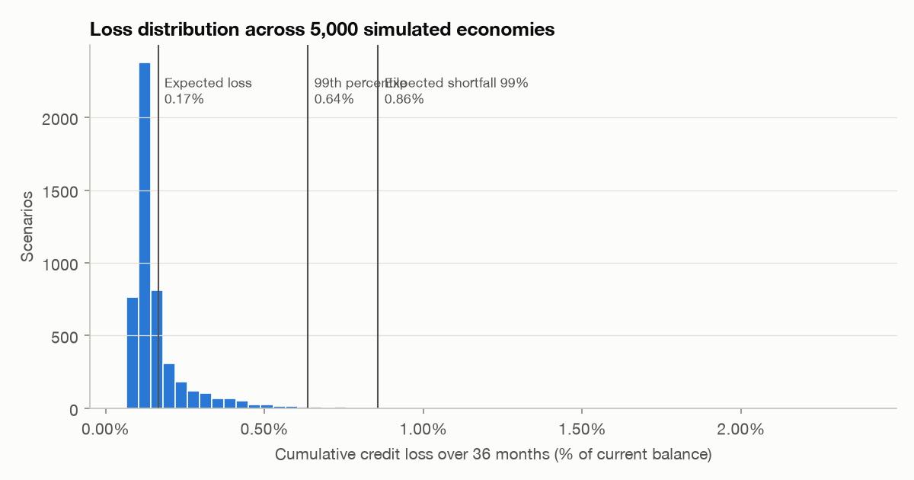
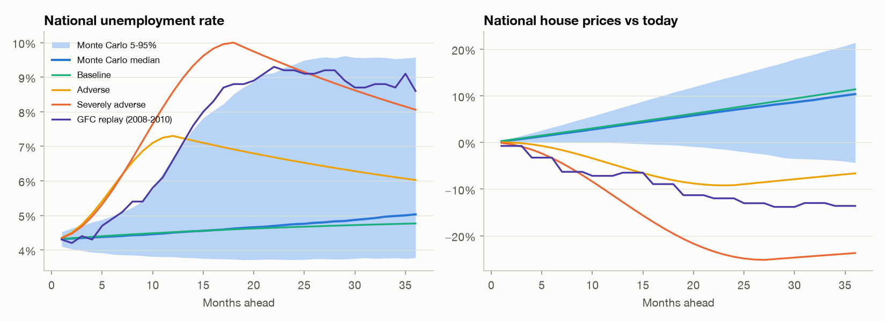
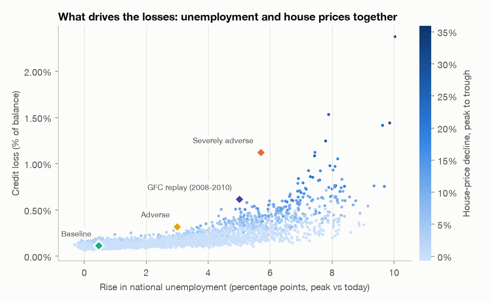
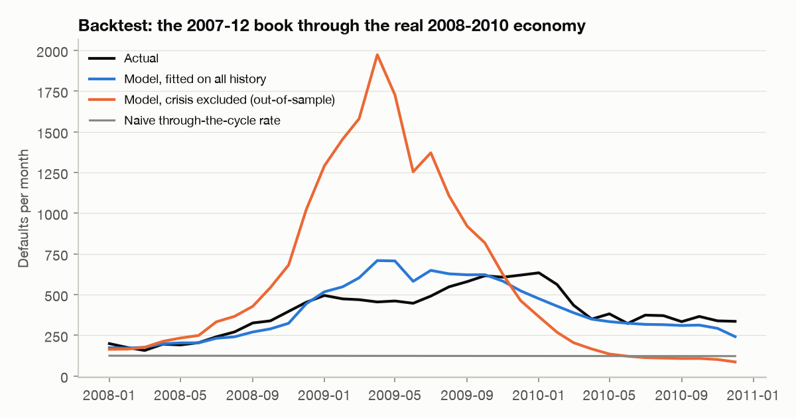

# Stress test: Monte Carlo credit-loss projection

*Generated by `loanlens stress` - profile `freddie`.*

**Portfolio:** 343,920 performing loans, $82.26B balance,
as of 2026-03. **Horizon:** 36 months. **Scenarios:** 5,000
simulated economies plus four named scenarios. Losses are projected on a 10,000-loan random
sample, scaled to the full book.

## Headline

| Measure | Loss rate | Loss amount |
|---|---:|---:|
| Expected loss (mean of all scenarios) | 0.17% | $136.1M |
| Median scenario | 0.13% | |
| 95th percentile | 0.38% | |
| **99th percentile (severe but plausible)** | **0.64%** | $524.2M |
| Expected shortfall, worst 1% | 0.86% | |
| Severely adverse (CCAR-style) scenario | 1.12% | |

34% of simulated paths contain a recession. The worst 1% of scenarios average a
peak unemployment rate of 12.1% and a national house-price fall of
17%.

## Named scenarios

| Scenario | Peak unemployment | House-price trough | Credit loss | Defaulted balance |
|:---|---:|---:|---:|---:|
| Baseline | 4.8% | 0.30% | 0.12% | 1.35% |
| Adverse | 7.3% | -9.20% | 0.32% | 2.22% |
| Severely adverse | 10.0% | -25.17% | 1.12% | 4.62% |
| GFC replay (2008-2010) | 9.3% | -13.82% | 0.62% | 3.39% |

## What drives the biggest losses

A linear fit of scenario loss on the macro summary explains **R² = 0.88** of the variation. Each extra point
of peak unemployment adds about **0.02%** of loss; each additional 10% house-price fall
adds **0.28%**. Losses are largest when both happen together - falling prices push
borrowers underwater exactly when job losses make them unable to pay, and the interaction terms in the hazard
model capture that compounding.

| decile | loss_rate | peak_unemployment | hpi_trough_change | recession_share |
|---:|---:|---:|---:|---:|
| 1 | 0.09% | 4.9% | 0.3% | 6% |
| 2 | 0.10% | 5.0% | 0.3% | 9% |
| 3 | 0.11% | 5.1% | 0.2% | 10% |
| 4 | 0.12% | 5.2% | 0.2% | 12% |
| 5 | 0.13% | 5.2% | 0.2% | 11% |
| 6 | 0.13% | 5.4% | 0.2% | 20% |
| 7 | 0.15% | 5.7% | 0.1% | 25% |
| 8 | 0.17% | 6.7% | -0.2% | 52% |
| 9 | 0.22% | 8.6% | -0.4% | 95% |
| 10 | 0.43% | 10.5% | -5.9% | 100% |

## Backtest: 2008-2010

The 217,884 loans performing at 2007-12 are projected through the **realised** state unemployment, house
prices and mortgage rates of the next 36 months, then compared with what actually happened.

| Measure | Actual | Model, all history | Model, crisis excluded | Naive |
|:---|---:|---:|---:|---:|
| Default rate (loans) | 6.53% | 6.57% | 9.66% | 2.04% |
| Credit loss (% of balance) | 2.08% | 1.92% | 2.96% | – |

- **Fitted on all history** (the production model), the specification reproduces the crisis within
  1% on defaults and 7% on losses.
- **Out of sample** - every 2007-2010 observation removed before fitting - the model captures the direction and timing of the crisis and beats a through-the-cycle benchmark (9.66% vs 2.04% projected against 6.53% actual). It over-predicts defaults by 48% and over-predicts losses by 43%. Without the crisis in the data, the hazard model carries its pre-crisis sensitivities to unemployment and negative equity into an economy far outside anything it was fitted on, and overshoots. The error is on the conservative side, but it is large: the gap between the two fits is a direct measure of **model uncertainty** in the tail, and the production model (fitted on all history, including the crisis) is the one to use.

## Method

1. **Hazard models.** Two discrete-time logistic models on 4,861,762 loan-months estimate the monthly
   probability of default (3,876 events, in-sample AUC 0.851) and
   voluntary prepayment (58,045 events, AUC 0.694) from borrower
   attributes, vintage cohort, loan age, mark-to-market LTV, state unemployment (level and 12-month change), the
   refinance incentive and stress interactions. COVID-forbearance months (2020-03 to 2021-12) are
   excluded from fitting because payment relief broke the usual unemployment-default link.
2. **LGD model.** Loss per default event (cures count as zero) regressed on LTV re-priced to the expected liquidation
   date (18 months after default, using the scenario's house-price path), mortgage insurance, judicial-foreclosure
   state and local unemployment. 52,122 resolved defaults, mean LGD 17.89%.
3. **Scenarios.** National unemployment, house prices and mortgage rates are simulated from dynamics estimated on
   FRED history with a recession regime (annual start probability 14%,
   random severity); states follow through estimated sensitivities (betas) plus idiosyncratic noise.
4. **Projection.** Each month, every loan's default and prepayment hazards are evaluated under the scenario;
   survival follows a competing-risks recursion, balances amortise, and expected default balance x LGD is summed.

Hazard coefficients (raw feature units):

| feature | default | prepayment |
|:---|---:|---:|
| fico_c | -0.980 | +0.103 |
| fico_low | -0.096 | -0.237 |
| dti_c | +0.206 | -0.008 |
| cltv_gap | +0.053 | +0.011 |
| investor | -0.182 | -0.340 |
| cash_out | +0.373 | -0.082 |
| single_borrower | +0.497 | -0.079 |
| short_term | -0.216 | +0.059 |
| log_upb_c | +0.112 | +0.462 |
| age_early | -1.363 | -3.551 |
| age_log | +0.187 | -0.581 |
| mtm | +1.175 | -1.002 |
| mtm_over80 | +4.120 | -1.542 |
| mtm_over100 | -4.362 | +1.473 |
| ur | +0.052 | -0.013 |
| ur_up | +0.164 | +0.032 |
| ur_down | +0.152 | +0.059 |
| refi | -0.006 | +0.340 |
| refi_pos | +0.328 | +0.280 |
| vint_pre2004 | +0.101 | +0.588 |
| vint_2004 | +0.222 | +0.246 |
| vint_2005_2007 | +0.408 | +0.111 |
| vint_2008 | +0.509 | +0.304 |
| underwater_x_ur | -0.012 | -0.224 |
| equity_stress_x_ur_up | +0.178 | -0.820 |

## Limitations

- Expected-value projection per loan (no loan-level randomness) - the distribution reflects macro uncertainty, which
  dominates portfolio credit risk; idiosyncratic noise diversifies away across tens of thousands of loans.
- Losses are recognised at default (expected LGD), not at the later liquidation date.
- Scenario dynamics and the recession regime are simple and calibrated to U.S. history since 1990; they are not a
  forecast. No new originations are assumed over the horizon (run-off book).
- Freddie Mac loans only; associations, not causal effects.
