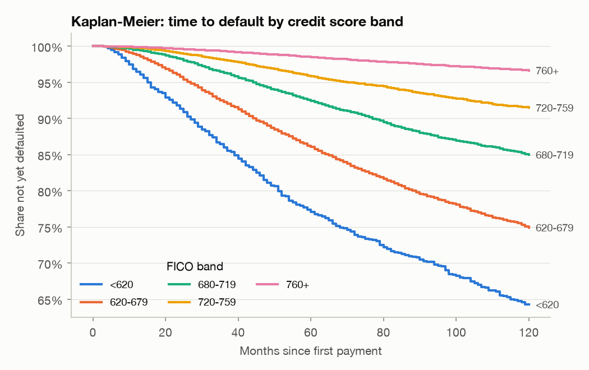
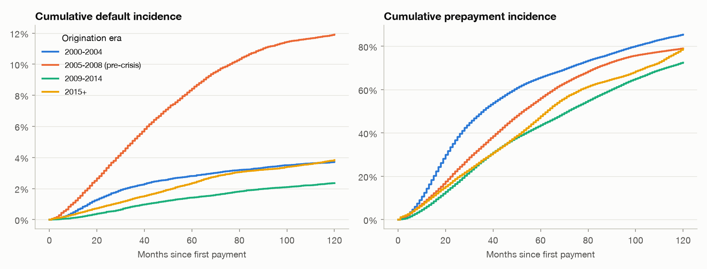
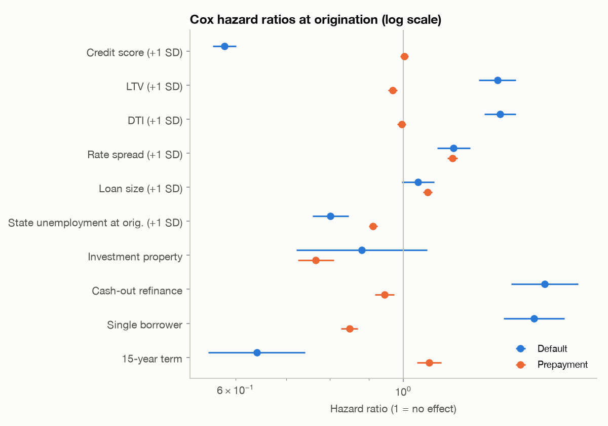
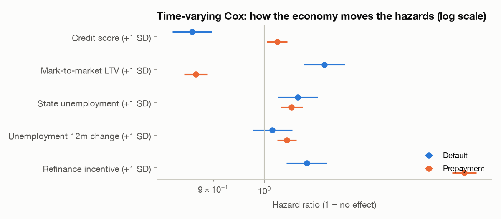

# Survival analysis: time to default and prepayment

*Generated by `loanlens survival` - profile `freddie`.*

1,360,167 loans followed from first payment: **57,831 defaults**, **951,350
prepayments**, 350,986 censored (active at the data cut-off, matured or repurchased).
Default and prepayment are competing risks - a loan that pays off can no longer default - so
cumulative incidence is estimated with Aalen-Johansen, and Kaplan-Meier curves treat the
competing event as censoring (a cause-specific view).

## Kaplan-Meier: share of loans not yet defaulted

| fico_band | loans | survival_24m | survival_60m | survival_120m |
|:---|---:|---:|---:|---:|
| <620 | 3,597 | 91.35% | 77.11% | 64.29% |
| 620-679 | 22,241 | 95.78% | 86.10% | 74.93% |
| 680-719 | 34,700 | 98.23% | 92.46% | 84.99% |
| 720-759 | 48,998 | 99.03% | 95.85% | 91.50% |
| 760+ | 90,146 | 99.61% | 98.49% | 96.66% |

## Cumulative incidence by origination era (Aalen-Johansen)

| era | loans | default_cif_24m | default_cif_60m | prepay_cif_24m | prepay_cif_60m |
|:---|---:|---:|---:|---:|---:|
| 2000-2004 | 43,500 | 1.5% | 2.8% | 35.8% | 65.4% |
| 2005-2008 (pre-crisis) | 29,364 | 3.3% | 8.4% | 21.7% | 55.6% |
| 2009-2014 | 44,105 | 0.5% | 1.4% | 16.0% | 43.3% |
| 2015+ | 83,031 | 0.9% | 2.3% | 18.5% | 47.5% |

Pre-crisis loans default several times more often than post-2009 loans, and every era shows
the refinance waves (2003, 2012, 2020-21) as steep steps in prepayment incidence. Prepayment
matters to an investor as much as default: it shortens the life of the asset and cuts the
interest income it earns.

## Cox proportional hazards at origination

Cause-specific models, continuous covariates standardised (hazard ratio per 1 SD).
Concordance: default **0.828**, prepayment **0.568**.

**Default hazard**

| covariate | hazard_ratio | ci_low | ci_high | p |
|:---|---:|---:|---:|---:|
| Credit score (+1 SD) | 0.58 | 0.56 | 0.60 | <0.001 |
| LTV (+1 SD) | 1.33 | 1.26 | 1.41 | <0.001 |
| DTI (+1 SD) | 1.34 | 1.28 | 1.41 | <0.001 |
| Rate spread (+1 SD) | 1.17 | 1.11 | 1.23 | <0.001 |
| Loan size (+1 SD) | 1.05 | 1.00 | 1.10 | 0.078 |
| State unemployment at orig. (+1 SD) | 0.80 | 0.76 | 0.85 | <0.001 |
| Investment property | 0.88 | 0.72 | 1.08 | 0.215 |
| Cash-out refinance | 1.54 | 1.39 | 1.70 | <0.001 |
| Single borrower | 1.49 | 1.36 | 1.63 | <0.001 |
| 15-year term | 0.64 | 0.55 | 0.74 | <0.001 |

**Prepayment hazard**

| covariate | hazard_ratio | ci_low | ci_high | p |
|:---|---:|---:|---:|---:|
| Credit score (+1 SD) | 1.00 | 0.99 | 1.02 | 0.611 |
| LTV (+1 SD) | 0.97 | 0.96 | 0.98 | <0.001 |
| DTI (+1 SD) | 0.99 | 0.98 | 1.01 | 0.427 |
| Rate spread (+1 SD) | 1.16 | 1.14 | 1.18 | <0.001 |
| Loan size (+1 SD) | 1.08 | 1.06 | 1.09 | <0.001 |
| State unemployment at orig. (+1 SD) | 0.91 | 0.90 | 0.92 | <0.001 |
| Investment property | 0.77 | 0.73 | 0.81 | <0.001 |
| Cash-out refinance | 0.94 | 0.92 | 0.97 | <0.001 |
| Single borrower | 0.85 | 0.83 | 0.87 | <0.001 |
| 15-year term | 1.08 | 1.04 | 1.12 | <0.001 |

*Proportional-hazards check* (Schoenfeld residual test, rank time transform): 4
of 10 default covariates and 6 of 10 prepayment covariates reject
PH at the 1% level. With this many loans small departures are detectable; the main one is that
origination attributes matter less as loans season and the economy takes over - which is why
the time-varying model below is the better description of risk.

## Time-varying Cox: how the economy moves the hazards

186,369 loan-quarter intervals. Covariates update every quarter.

**Default hazard**

| covariate | hazard_ratio | ci_low | ci_high | p |
|:---|---:|---:|---:|---:|
| Credit score (+1 SD) | 0.86 | 0.83 | 0.90 | <0.001 |
| Mark-to-market LTV (+1 SD) | 1.13 | 1.08 | 1.18 | <0.001 |
| State unemployment (+1 SD) | 1.07 | 1.03 | 1.12 | 0.001 |
| Unemployment 12m change (+1 SD) | 1.02 | 0.98 | 1.06 | 0.431 |
| Refinance incentive (+1 SD) | 1.09 | 1.05 | 1.14 | <0.001 |

**Prepayment hazard**

| covariate | hazard_ratio | ci_low | ci_high | p |
|:---|---:|---:|---:|---:|
| Credit score (+1 SD) | 1.03 | 1.01 | 1.05 | 0.015 |
| Mark-to-market LTV (+1 SD) | 0.87 | 0.85 | 0.89 | <0.001 |
| State unemployment (+1 SD) | 1.06 | 1.03 | 1.08 | <0.001 |
| Unemployment 12m change (+1 SD) | 1.05 | 1.03 | 1.07 | <0.001 |
| Refinance incentive (+1 SD) | 1.51 | 1.47 | 1.55 | <0.001 |

- A one-standard-deviation rise in mark-to-market LTV multiplies the default hazard by
  **1.13x**, and a 1 SD rise in state unemployment by
  **1.07x**.
- A 1 SD larger refinance incentive multiplies the prepayment hazard by
  **1.51x**, while higher mark-to-market LTV
  suppresses prepayment (0.87x) - underwater borrowers cannot refinance.

These are associations estimated from observational data, not causal effects.
